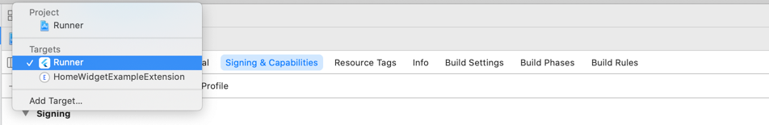

# Home Widget

[](https://pub.dartlang.org/packages/home_widget)

HomeWidget is a Plugin to make it easier to create HomeScreen Widgets on Android and iOS.
HomeWidget does **not** allow writing Widgets with Flutter itself. It still requires writing the Widgets with native code. However it provides a unified Interface for sending data, retrieving data and updating the Widgets

## Platform Setup
As stated there needs to be some platform specific setup. Check below on how to add support for Android and iOS

<details><summary>Android</summary>

### Create Widget Layout inside `android/app/res/layout`

### Create Widget Configuration into `android/app/res/xml`
```xml
<?xml version="1.0" encoding="utf-8"?>
<appwidget-provider xmlns:android="http://schemas.android.com/apk/res/android"
    android:minWidth="40dp"
    android:minHeight="40dp"
    android:updatePeriodMillis="86400000"
    android:initialLayout="@layout/example_layout"
    android:resizeMode="horizontal|vertical"
    android:widgetCategory="home_screen">
</appwidget-provider>
```

### Add WidgetReceiver to AndroidManifest
```xml
<receiver android:name="HomeWidgetExampleProvider" >
    <intent-filter>
        <action android:name="android.appwidget.action.APPWIDGET_UPDATE" />
    </intent-filter>
    <meta-data android:name="android.appwidget.provider"
        android:resource="@xml/home_widget_example" />
</receiver>
```

### Write your WidgetProvider
For convenience you can extend from [HomeWidgetProvider](android/src/main/kotlin/es.antonborri/home_widget/HomeWidgetProvider.kt) which gives you access to a SharedPreferences Object with the Data in the `onUpdate` method.
If you don't want to use the convenience Method you can access the Data using
```kotlin
import es.antonborri.home_widget.HomeWidgetPlugin
...
HomeWidgetPlugin.getData(context)
```
which will give you access to the same SharedPreferences

### More Information
For more Information on how to create and configure Android Widgets checkout (https://developer.android.com/guide/topics/appwidgets)[this guide] on the Android Developers Page.

</details>

<details><summary>iOS

### Add a Widget to your App in Xcode
Add a widget extension by going `File > Target > Widget Extension`


### Add GroupId
You need to add a groupId to the App and the Widget Extension

**Note: in order to add groupIds you need a paid Apple Developer Account**

Go to your [Apple Developer Account](https://developer.apple.com/account/resources/identifiers/list/applicationGroup) and add a new group
Add this group to you Runner and the Widget Extension inside XCode `Signing & Capabilities > App Groups > +`



(To swap between your App and the Extension change the Target)

### Write your Widget
Check the [Example App](example/ios/HomeWidgetExample/HomeWidgetExample.swift) for an Implementation of a Widget
A more detailed overview on how to write Widgets for iOS 14 can fbe found on the [Apple Developer documentation](https://developer.apple.com/documentation/swiftui/widget)
In order to access the Data send with Flutter can be access with
```swift
let data = UserDefaults.init(suiteName:"YOUR_GROUP_ID")
```
</details>

## Usage

### Install
Update pubspec.yaml and add the dependency on home_widget to your app
```
dependencies:
  home_widget: ^0.0.1
```

### Setup
For iOS you need to call `HomeWidget.setAppGroupId('YOUR_GROUP_ID');`
Without this you won't be able to share data between your App and the Widget and calls to `saveWidgetData` and `getWidgetData` will return an error

### Save Data
In order to save Data call `HomeWidget.saveWidgetData<String>('id', data)`

### Update a Widget
In order to force a reload of the HomeScreenWidget you need to call
```dart
HomeWidget.updateWidget(
    name: 'HomeWidgetExampleProvider',
    androidName: 'HomeWidgetExampleProvider',
    iOSName: 'HomeWidgetExample');
```

The name for Android will be chosen by checking `androidName` if that was not provided it will fallback to `name`.
This Name needs to be equal to the Classname of the [WidgetProvider](#-write-your-widgetprovider)

The name for iOS will be chosen by checking `iOSName` if that was not provided it will fallback to `name`.
This name needs to be equal to the Kind specified in you Widget

### Retrieve Data
To retrieve the current Data saved in the Widget call `HomeWidget.getWidgetData<String>('id', defaultValue: data)`

